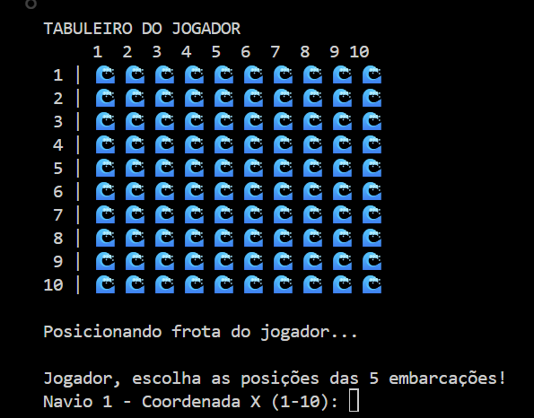
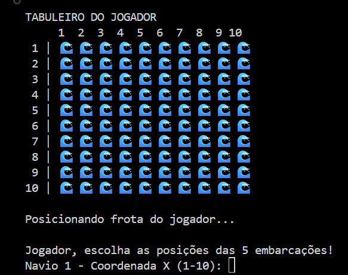
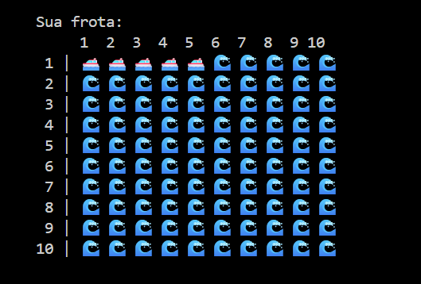
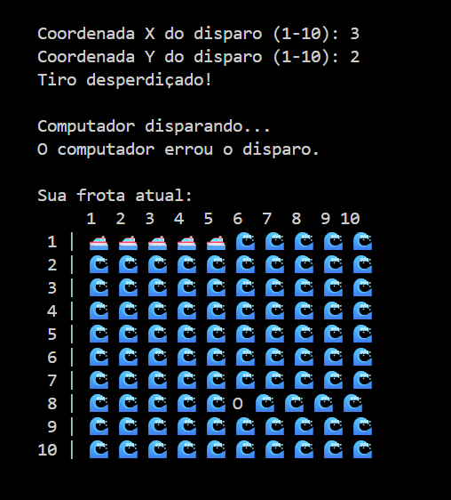
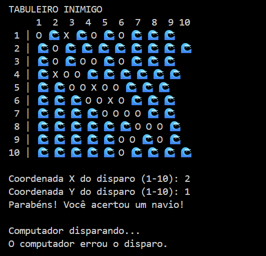
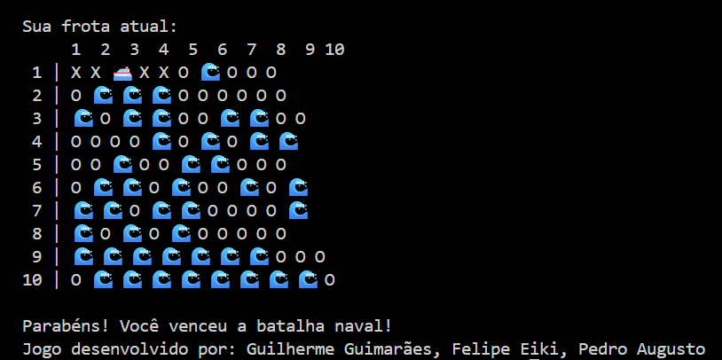

# 🚢 Batalha Naval em Python

## 📖 Sobre o Projeto

Este projeto consiste em uma implementação do clássico jogo **Batalha Naval** desenvolvida em Python utilizando conceitos fundamentais da programação, como:

* Matrizes (listas bidimensionais)
* Estruturas de repetição
* Estruturas condicionais
* Funções
* Geração de números aleatórios
* Manipulação de entrada e saída de dados

O objetivo do jogo é destruir todas as embarcações inimigas antes que o computador destrua as suas.

---

# ⚙️ Funcionamento do Jogo

O jogo é executado inteiramente pelo terminal e ocorre em três etapas principais:

1. Criação dos tabuleiros
2. Posicionamento das embarcações
3. Fase de batalha

Cada jogador (usuário e computador) possui:

* Um tabuleiro de 10x10 posições
* 5 embarcações
* Sistema de disparos por coordenadas

---

# 🖼️ Etapa 1 – Inicialização do Tabuleiro

Ao iniciar o programa, o sistema gera automaticamente dois tabuleiros vazios de tamanho 10x10.

Cada posição é representada inicialmente pelo símbolo:

🌊 = Água



---

# 🖼️ Etapa 2 – Posicionamento das Embarcações

O jogador escolhe manualmente as coordenadas onde deseja posicionar suas 5 embarcações.

O sistema solicita os valores X e Y para cada navio.



Exemplo:

```text
Navio 1 - Coordenada X (1-10): 1
Navio 1 - Coordenada Y (1-10): 1
```

Após cada posicionamento, o sistema informa quantas embarcações ainda faltam ser posicionadas.

---

# 🖼️ Etapa 3 – Visualização da Frota

Após o posicionamento, o jogador pode visualizar a localização de todos os seus navios.

Símbolos utilizados:

* 🛥️ = Embarcação
* 🌊 = Água



---

# 🖼️ Etapa 4 – Início da Batalha

A fase de batalha começa após a definição das posições dos navios.

O jogador escolhe uma coordenada para realizar um disparo.

Exemplo:

```text
Coordenada X do disparo: 3
Coordenada Y do disparo: 2
```

O sistema verifica se houve:

* Acerto
* Erro
* Tentativa de disparo repetido



---

# 🖼️ Etapa 5 – Resposta do Computador

Após o disparo do jogador, o computador realiza automaticamente sua jogada.

As coordenadas são escolhidas aleatoriamente.

O sistema informa:

* Quando o computador acerta um navio.
* Quando o computador erra o alvo.



---

# 🖼️ Etapa 6 – Atualização do Tabuleiro

A cada rodada o tabuleiro é atualizado.

Símbolos adicionais:

| Símbolo | Significado    |
| ------- | -------------- |
| 🛥️     | Navio          |
| 🌊      | Água           |
| X       | Navio atingido |
| O       | Tiro na água   |

---

# 🖼️ Etapa 7 – Vitória do Jogador



Quando o jogador destrói todas as 5 embarcações inimigas, a partida é encerrada e uma mensagem de vitória é exibida.

```text
Parabéns! Você venceu a batalha naval!
```

---

# 🖼️ Etapa 8 – Vitória do Computador

> INSERIR IMAGEM AQUI

Caso o computador destrua todas as embarcações do jogador primeiro, o sistema encerra a partida exibindo a mensagem de derrota.

```text
O computador venceu a batalha naval!
```

---

# 🖼️ Etapa 9 – Estado Final da Partida

> INSERIR IMAGEM AQUI

Nesta etapa pode ser exibido o estado final dos tabuleiros, mostrando todas as posições atingidas e o resultado da batalha.

---

# 🧠 Estruturas Utilizadas

Durante o desenvolvimento foram utilizados diversos conceitos da linguagem Python:

## Matrizes

Os tabuleiros são representados através de listas bidimensionais:

```python
tabuleiro = [["🌊" for _ in range(10)] for _ in range(10)]
```

---

## Funções

Para modularizar o código foram criadas funções específicas para:

* Criar tabuleiro
* Posicionar embarcações
* Exibir tabuleiro
* Realizar disparos
* Verificar vitória

---

## Biblioteca Random

Utilizada para:

* Posicionar os navios do computador
* Escolher os disparos do computador
* Exibir mensagens aleatórias

```python
import random
```

---

# 🎯 Objetivos de Aprendizagem

Este projeto permitiu praticar:

* Manipulação de matrizes
* Desenvolvimento de jogos simples
* Estruturação de código em funções
* Validação de entradas
* Uso de algoritmos de busca e verificação
* Lógica de programação

---

# 👨‍💻 Autor

Projeto desenvolvido para fins acadêmicos e de aprendizado da linguagem Python.

---

# 🚀 Como Executar

1. Instale o Python 3.
2. Baixe o arquivo do projeto.
3. Abra o terminal na pasta do arquivo.
4. Execute:

```bash
python Batalha_Naval_Corrigida.py
```

ou

```bash
python3 Batalha_Naval_Corrigida.py
```

5. Siga as instruções exibidas na tela.
